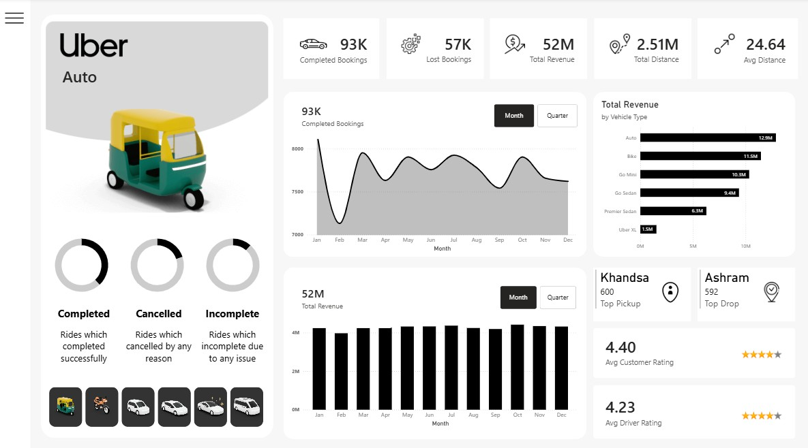
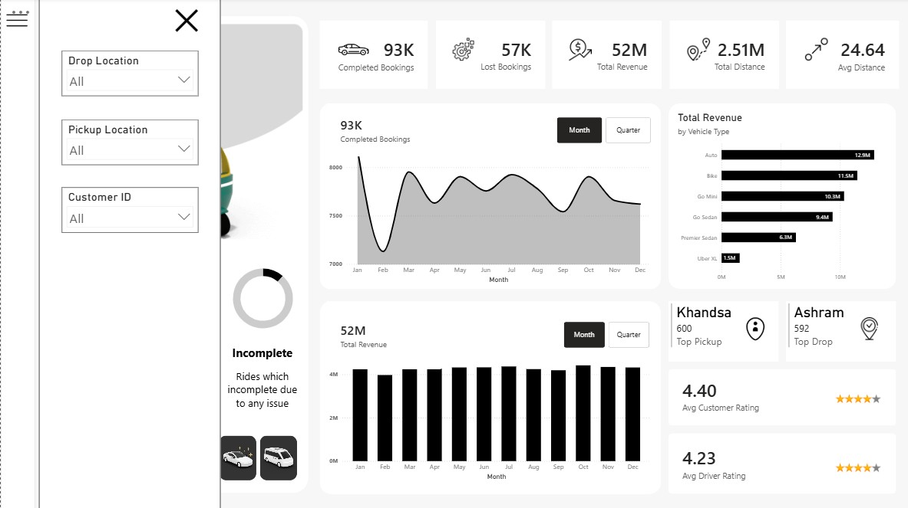
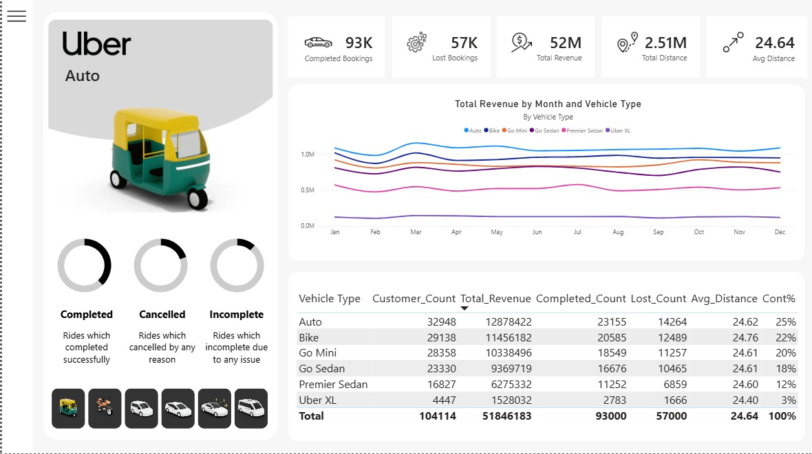

# 🚖 Uber Ride Analytics Dashboard — Power BI


An end-to-end interactive business intelligence dashboard built in **Microsoft Power BI**, analyzing ride-booking performance across vehicle types, locations, and time periods for an Uber-style ride-hailing service.

---

## 📊 Dashboard Preview

| Main Dashboard | Filter Panel | Revenue Deep Dive |
|:-:|:-:|:-:|
|  |  |  |

---

## 🎯 Project Objective

The goal of this project was to design a professional, executive-level analytics dashboard that enables stakeholders to:

- Monitor **booking performance** (completed, cancelled, incomplete) at a glance
- Analyze **revenue trends** over time and across vehicle categories
- Identify **top pickup and drop-off locations** to optimize driver allocation
- Evaluate **customer and driver satisfaction** through rating metrics
- Drill down into data using **interactive filters** by location and customer ID

---

## 📌 Key Metrics & KPIs

| Metric | Value |
|--------|-------|
| ✅ Completed Bookings | 93,000 |
| ❌ Lost Bookings | 57,000 |
| 💰 Total Revenue | ₹52 Million |
| 📍 Total Distance | 2.51 Million km |
| 📏 Avg. Trip Distance | 24.64 km |
| ⭐ Avg. Customer Rating | 4.40 / 5 |
| ⭐ Avg. Driver Rating | 4.23 / 5 |

---

## 🚗 Vehicle Type Breakdown

| Vehicle Type | Customers | Total Revenue | Completed | Lost | Avg Distance | Share |
|---|---|---|---|---|---|---|
| Auto | 32,948 | ₹12.87M | 23,155 | 14,264 | 24.62 km | 25% |
| Bike | 29,138 | ₹11.46M | 20,585 | 12,489 | 24.76 km | 22% |
| Go Mini | 28,358 | ₹10.34M | 18,549 | 11,257 | 24.61 km | 20% |
| Go Sedan | 23,330 | ₹9.37M | 16,676 | 10,465 | 24.61 km | 18% |
| Premier Sedan | 16,827 | ₹6.28M | 11,252 | 6,859 | 24.60 km | 12% |
| Uber XL | 4,447 | ₹1.53M | 2,783 | 1,666 | 24.40 km | 3% |

---

## ✨ Dashboard Features

### 📈 Visualizations
- **Area/Line Chart** — Monthly completed bookings trend (Jan–Dec) with Month/Quarter toggle
- **Bar Chart** — Monthly total revenue trend with Month/Quarter toggle
- **Horizontal Bar Chart** — Revenue breakdown by vehicle type
- **Multi-Line Chart** — Revenue by month per vehicle type (comparative view)
- **Donut Charts** — Booking status distribution (Completed / Cancelled / Incomplete)
- **Data Table** — Full vehicle-level summary with all KPIs

### 🔍 Interactivity & Filtering
- **Slide-out Filter Panel** — Filter by Drop Location, Pickup Location, and Customer ID
- **Vehicle Type Navigation** — Click vehicle icons in the sidebar to switch context
- **Month / Quarter Toggle** — Dynamic chart switching for time granularity
- **Cross-filtering** — All visuals respond to slicer selections

### 🎨 Design & UX
- Clean, minimal white theme consistent with the Uber brand identity
- Branded sidebar with vehicle imagery and contextual ride-status legend
- Responsive layout with logically grouped KPI cards, charts, and detail panels
- Icon-based metric cards for quick executive scanning

---

## 🛠️ Tools & Technologies

| Tool / Skill | Usage |
|---|---|
| **Microsoft Power BI Desktop** | Report authoring, data modeling, publishing |
| **Power Query (M Language)** | Data ingestion, transformation, and cleaning |
| **DAX (Data Analysis Expressions)** | Calculated columns, measures, KPIs (CALCULATE, SUMX, DIVIDE, etc.) |
| **Data Modeling** | Star schema design, table relationships, cardinality management |
| **Bookmarks & Buttons** | Filter panel show/hide toggle, Month/Quarter chart switching |
| **Slicers & Cross-filtering** | Interactive drill-down by location, vehicle type, customer |
| **Custom Visuals & Formatting** | Donut charts, area charts, conditional formatting |
| **UX / Dashboard Design** | Layout design, color theming, icon usage, storytelling with data |

---

## 📁 Repository Structure

```
uber-powerbi-dashboard/
│
├── 📂 screenshots/
│   ├── dashboard_main.png       # Main overview dashboard
│   ├── filter_panel.png         # Filter/slicer panel view
│   └── revenue_detail.png       # Revenue deep-dive view
│
├── 📂 data/
│   └── uber_rides_data.xlsx     # Source dataset (sample/anonymized)
│
├── UberDashboard.pbix           # Power BI project file
└── README.md
```

---

## 🚀 How to Open This Project

1. **Download** [Microsoft Power BI Desktop](https://powerbi.microsoft.com/desktop/) (free).
2. **Clone** this repository:
   ```bash
   git clone https://github.com/YOUR_USERNAME/uber-powerbi-dashboard.git
   ```
3. **Open** `UberDashboard.pbix` in Power BI Desktop.
4. If prompted, update the data source path to point to the local `data/` folder.
5. Click **Refresh** to reload the data model.

---

## 💡 Key Learnings

- Designing **multi-page, drill-through ready** dashboards from scratch
- Writing **complex DAX measures** for dynamic KPI calculations
- Implementing **bookmarks and buttons** for a seamless UX without page navigation
- Applying **data modeling best practices** (star schema, calculated tables)
- Translating raw transactional data into **executive-ready business insights**
- Balancing **visual density** with clarity for a professional look

---

## 🔮 Future Improvements

- [ ] Connect to a **live SQL database** or real-time API feed
- [ ] Add **driver-level performance** analysis page
- [ ] Build a **forecast model** using Power BI's built-in analytics
- [ ] Publish to **Power BI Service** with scheduled refresh
- [ ] Add **mobile layout** view for phone/tablet access

---

## 👤 Author

**[Your Name]**
📧 your.email@example.com
🔗 [LinkedIn](https://linkedin.com/in/yourprofile) | [Portfolio](https://yourwebsite.com)

---

## 📄 License

This project is licensed under the [MIT License](LICENSE) — feel free to use it as inspiration for your own portfolio projects.

---

> ⭐ If you found this project useful or insightful, feel free to **star** the repository!
